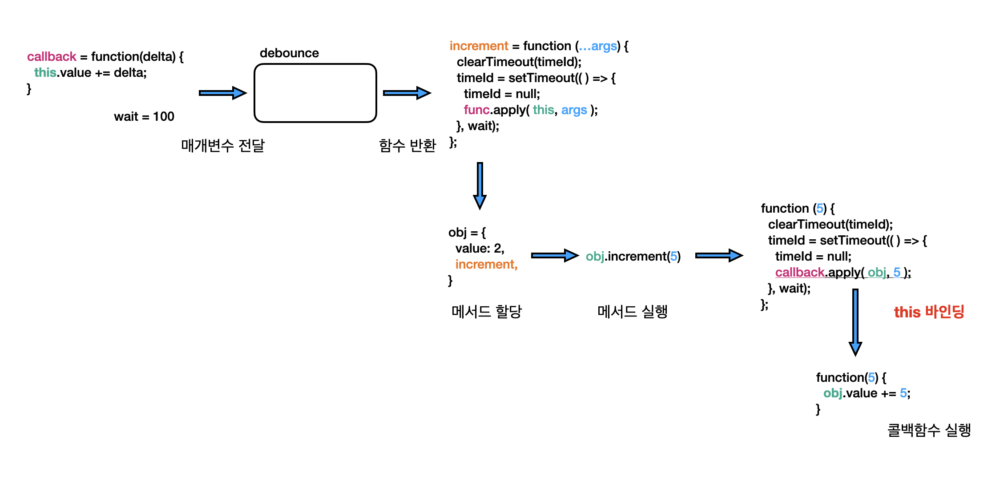
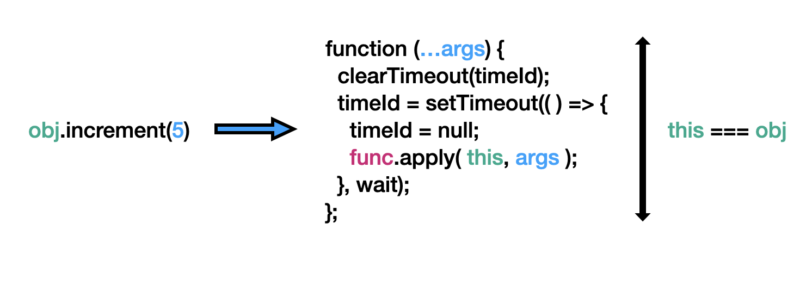
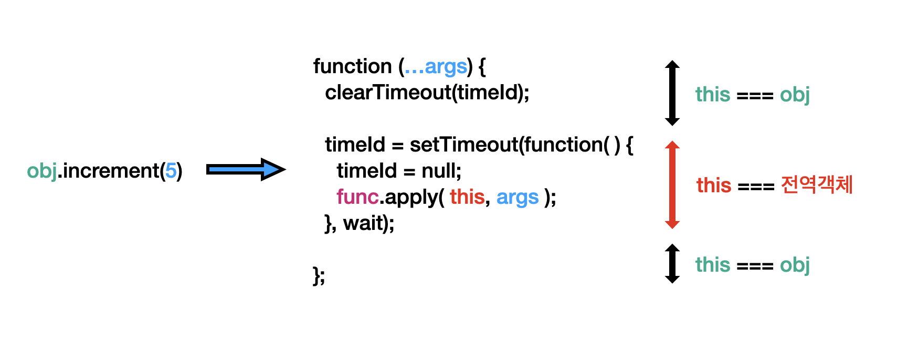

# Debounce

디바운스는 시간이 지남에 따라 함수가 실행되도록 허용하는 횟수를 제어하는데 사용되는 기술입니다.
자바스크립트 함수가 X 밀리초의 대기시간으로 디바운스 되어있다면, 함수가 마지막으로 호출된 시점으로부터 X ms초가 지나야 실행됩니다. 우리는 일상속에서 엘리베이터를 탈 때 디바운스를 접해볼 수 있습니다. X 시간 동안 열림 버튼을 누르지 않아야만 엘리베이터 문이 실제로 닫힙니다.

콜백 함수와 wait 시간을 인자로 받는 debounce 함수를 구현해봅시다. 앞에 설명을 따라 Debounce를 호출하면 콜백 함수 호출을 디바운스하는 함수를 반환해야 합니다.

## Leet Code

[Problem](https://leetcode.com/problemset/javascript/)
[Solution](https://github.com/gpgun0/leetcode/tree/master/2627-debounce)

## Prerequisite

- 클로저
- this 바인딩

## Examples

```js
let i = 0;
function increment() {
  i++;
}
const debouncedIncrement = debounce(increment, 100);

// t = 0: Call debouncedIncrement().
debouncedIncrement(); // i = 0

// t = 50: i is still 0 because 100ms have not passed.

// t = 100: increment() was invoked and i is now 1.
```

```js
let i = 0;
function increment() {
  i++;
}
const debouncedIncrement = debounce(increment, 100);

// t = 0: Call debouncedIncrement().
debouncedIncrement(); // i = 0

// t = 50: i is still 0 because 100ms have not passed.
//  Call debouncedIncrement() again.
debouncedIncrement(); // i = 0

// t = 100: i is still 0 because it has only
//  been 50ms since the last debouncedIncrement() at t = 50.

// t = 150: Because 100ms have passed since
//  the last debouncedIncrement() at t = 50,
//  increment was invoked and i is now 1 .
```

## Goals

### 아래 예제가 실행되는 과정을 그림으로 설명할 수 있다.

```js
const increment = debounce(function (delta) {
    this.val += delta;
}, 10);

const obj = {
    val: 2,
    increment,
};

obj.increment(3);
```



### wrong 1, 2, 3이 오답인 이유를 설명할 수 있다.

세 경우 모두 다음 테스트를 통과하지 못합니다.

```js
  test('callbacks can access `this`', (done) => {
    const increment = debounce(function (delta) {
      this.val += delta;
    }, 10);

    const obj = {
      val: 2,
      increment,
    };

    expect(obj.val).toBe(2);
    obj.increment(3);
    expect(obj.val).toBe(2);

    setTimeout(() => {
      expect(obj.val).toBe(5);
      done();
    }, 20);
  });
```

#### wrong1 - 함수의 apply 메서드

wrong1.js의 코드입니다.

```js
function debounce(func, wait = 0) {
  let timeId = null;

  return function (...args) {
    clearTimeout(timeId);

    timeId = setTimeout(() => {
      console.log(func(...args));
    }, wait);
  };
}
```

위에선 debounce의 콜백함수로 다음 함수를 전달하였습니다.  
```js
function (delta) {
    this.val += delta;
}
```

이제 `obj.increment(3);`를 실행하면 debounce함수가 반환한 함수가 실행될 것이고 wait초 뒤에 콜백함수가 실행됩니다. 하지만, 콜백으로 전달한 일반 함수(function)를 call이나 apply 또는 bind 메서드를 사용하여 호출하지 않는다면, 콜백 함수 내의 this는 전역 객체를 가리키게 됩니다.

결과적으로, 전역객체의 val 프로퍼티에 인자로 전해준 값을 더해주는 꼴이 됩니다.  

apply로 this를 주입하여 호출하면 정답이 됩니다.

#### wrong2 - function의 this

그러면 setTimeout의 콜백 함수를 화살표 함수가 아니라 function 함수를 사용하면 어떻게 될까요?

```js
function debounce(func, wait = 0) {
  let timeId = null;

  return function (...args) {
    clearTimeout(timeId);

    timeId = setTimeout(function () {
      func.apply(this, args);
    }, wait);
  };
}
```

Fail입니다. 왜 그럴까요? 

먼저 setTimeout의 콜백으로 화살표 함수를 넣었을 때 메서드 호출시 this 바인딩의 범위입니다. 



화살표 함수는 상위 실행 컨텍스트의 this를 참조하기 때문이죠.

그러면 function으로 대체했을 때 메서드 호출시 this 바인딩 범위를 확인해봅시다.



this가 전역 객체를 바라보게 돼어 wrong1과 같은 결과를 가져오게 됩니다.
*function은 call, apply로 호출하지 않으면 언제나 내부의 this가 전역객체를 참조한다는 것을 잊지 맙시다.*

#### wrong3 - 화살표 함수의 this

궁금증이 생겨서 아래와 같이 코드를 작성해봤습니다. 결과는 어떻게 될까요?

```js
function debounce(func, wait = 0) {
  let timeId = null;

  return (...args) => {
    clearTimeout(timeId);

    timeId = setTimeout(() => {
      func.apply(this, args);
    }, wait);
  };
}
```

어쨌든 debounce의 반환값이 obj의 메서드로 할당됐다면, `obj.increment(3)` 호출시 this엔 obj가 바인딩 될 것 같습니다.

```js
const obj = {
  val: 2,
  increment, // arrow function
};
```

하지만 this는 전역 객체를 참조합니다.

화살표 함수는 자신만의 this 컨텍스트를 가지지 않고 자신을 감싸고 있는 것 중 가장 인접한 regular function의 this를 참조합니다.  
아래 예제에서도 arrowFn 메서드를 실행하면, this가 obj를 가리키지 못하고 최 상위 실행 컨텍스트의 this인 전역 객체를 참조합니다.

```js
const obj = {
  arrowFn: () => {
    console.log(this);
  },
  regularFn: function () {
    console.log(this);
  },
};

obj.arrowFn(); // 전역 객체
obj.regularFn(); // { test: [Function: test], test2: [Function: test2] }

```
