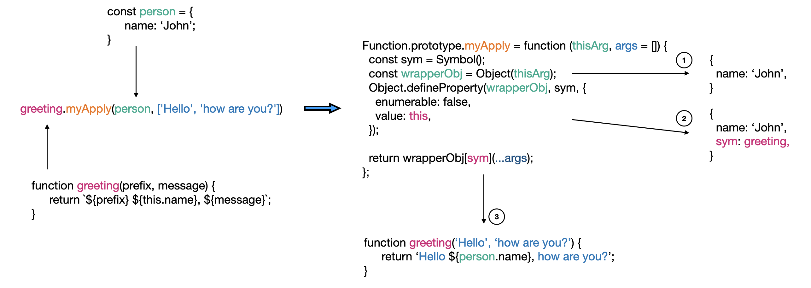

# Function.prototype.apply

> The Function.prototype.apply() method calls the specified function with a given this value, and arguments provided as an array (or an array-like object).

Source: [Function.prototype.apply() - JavaScript | MDN](https://developer.mozilla.org/en-US/docs/Web/JavaScript/Reference/Global_objects/Function/apply)

Implement your own Function.prototype.apply without calling the native apply method. To avoid overwriting the actual Function.prototype.apply, implement the function as Function.prototype.myApply.

## Goals

### Object 생성자 함수에 대해 알 수 있다.

Object 생성자는 인자로 받은 값을 객체로 만들어줍니다. 전달받은 인자의 type에 따라 결과값이 결정됩니다. 

```js
const obj = new Object(value);
const obj = Object(value);
```

- <u>만약, value가 `null` 또는 `undefined`라면 **빈 객체**를 반환합니다.</u>  
- <u>value가 object라면 이 객체를 그대로 반환합니다.</u>  
- 그 외에는 value의 타입에 해당하는 래퍼 객체를 반환합니다.  

```js
const bigintObj = Object(1n);
console.log(bigintObj); // BigInt { 1n }

const symbolObj = Object(Symbol("foo"));
console.log(symbolObj); // Symbol { Symbol(foo), description: 'foo' }
```

### 아래 예제가 실행되는 과정을 그림으로 설명할 수 있다.

```js
const person = {
  name: 'John',
};

function greeting(prefix, message) {
  return `${prefix} ${this.name}, ${message}`;
}

greeting.myApply(person, ['Hello', 'how are you?'])
```



1. thisArg엔 오브젝트 또는 null값이 올 수 있습니다. 특히 null값이 오는 것을 대비하기 위해 `Object()` 함수를 사용했습니다.
2. `Object.defineProperty`를 사용하여 thisArg로 받은 객체에 메서드를 할당합니다. `this`는 프로토타입 메서드를 호출한 `greeting` 함수를 참조합니다. 
3. thisArg로 전달받은 객체의 메서드로써 `geeting` 함수 호출이 가능해졌습니다. 호출시 `greeting`내부의 this는 `person`객체를 참조합니다. 아울러 thisArg를 null로 전달하여 this binding을 신경쓰지 않고 단순히 함수를 호출 하는 경우도 대비할 수 있습니다.

물론

```js
  Object.defineProperty(wrapperObj, sym, {
    enumerable: false,
    value: this,
  });
```

대신

```js
wrapperObj[sym] = this;
```
를 사용해도 됩니다. 다만, `for ... in`, `Object.keys()` 또는 `Object.entries()`을 사용하면 유의미한 정보인 property값만 보이는 게 아니라 할당해준 메서드까지 보이게 됩니다. 위 문제에선 후자를 선택해도 크게 상관은 없겠지만, 메서드를 매핑할 땐 열거해도 보이지 않도록 `Object.defineProperty`를 사용하는 게 좋을 것 같습니다.
