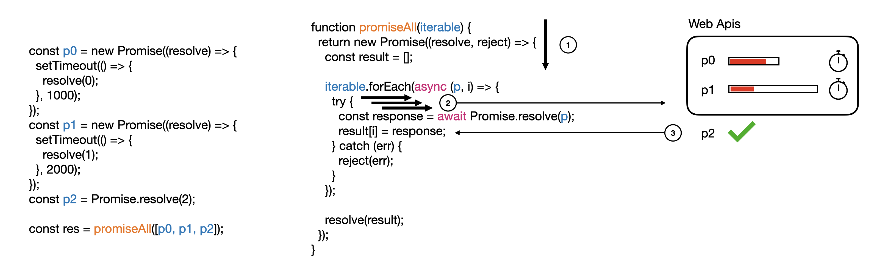
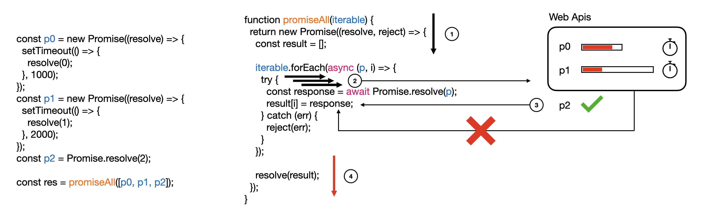
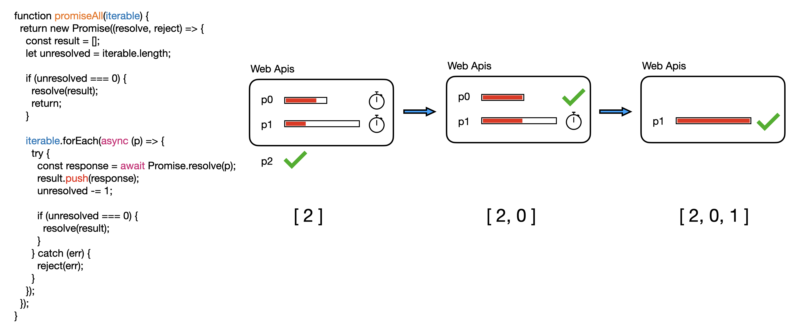

# Promise.all

`Promise.all()`은 iterable을 받아 이들 각각 요소들을 resolve한 값이 담겨있는 Promise 배열을 반환하는 함수입니다. 반환된 promise는 배열의 모든 promise 요소들이 resolved 되거나 요소가 promise를 포함하지 않을 때 resolve 됩니다. 그리고 배열의 어느 요소가 reject하는 프로미스이거나 에러를 던지는 non-promise라면 가장 처음으로 reject된 메세지 또는 에러와 함께 즉시 reject됩니다.

Source: [Promise.all() - JavaScript | MDN](https://www.greatfrontend.com/questions/javascript/promise-all)

Promise.all()은 여러개의 동시성 API 요청이 있을 때 코드 실행을 이어나가기 위해서 이들이 완료되기를 기다릴 때 사용됩니다. 

```js
const [userData, postsData, tagsData] = await Promise.all([
  fetch('/api/user'),
  fetch('/api/posts'),
  fetch('/api/tags'),
]);
```

이제 iterable 대신 배열을 받는 `Promise.all()`을 구현해 봅시다.

## Examples

```js
// Resolved example.
const p0 = Promise.resolve(3);
const p1 = 42;
const p2 = new Promise((resolve, reject) => {
  setTimeout(() => {
    resolve('foo');
  }, 100);
});

await promiseAll([p0, p1, p2]); // [3, 42, 'foo']
```

```js
// Rejection example.
const p0 = Promise.resolve(30);
const p1 = new Promise((resolve, reject) => {
  setTimeout(() => {
    reject('An error occurred!');
  }, 100);
});

try {
  await promiseAll([p0, p1]);
} catch (err) {
  console.log(err); // 'An error occurred!'
}

```

## Goals

### solution이 실행되는 과정을 그림으로 설명할 수 있다.


### wrong 1, 2이 오답인 이유를 설명할 수 있다.

#### wrong1 - 요소가 resolve돼서 배열에 담기기 전에 배열을 resolve합니다.

```js
export default function promiseAll(iterable: Array<any>): Promise<Array<any>> {
  return new Promise((resolve, reject) => {
    const result = [];

    iterable.forEach(async (p, i) => {
      try {
        const response = await Promise.resolve(p);
        result[i] = response;
      } catch (err) {
        reject(err);
      }
    });

    resolve(result);
  });
}
```

위 함수에 아래 배열을 전달해보겠습니다.

```js
const p0 = new Promise((resolve) => {
  setTimeout(() => {
    resolve(0);
  }, 1000);
});
const p1 = new Promise((resolve) => {
  setTimeout(() => {
    resolve(1);
  }, 2000);
});
const p2 = Promise.resolve(2);

const res = promiseAll([p0, p1, p2]);
```

함수가 실행되는 과정은 다음과 같습니다.



1번과 첫번째 forEach 루프가 돌아서 await 전까지의 2번 과정에선 코드가 동기적으로 실행됩니다. 그리고 await문을 만나면 Promise가 settled 상태가 될 때까지 기다리는데 이는 **비동기**로 실행됩니다. 따라서 다음 forEach 루프가 이를 기다리지 않고 실행됩니다. 또 await문을 만나면 Promise가 settled가 될 때까지 기다리는 것을 반복합니다.

만약 iterable의 요소가 Promise가 아닌 상수이거나 Promise.resolve로 감싸진 상수값이라면 바로 resolve된 값을 반환합니다. 따라서 3번과정에서 p2가 result 배열에 삽입됩니다. 

그러나, p0과 p1가 resolve되지 않았지만 forEach문이 끝나고 나머지 코드가 실행되버립니다.



결과는 [undefined, undefined, 2]가 나오게 됩니다. solution처럼 forEach 구문 안에서 resolve를 하여 모든 promise 요소가 끝날때까지 배열을 resolve하면 안됩니다. 

#### wrong2 - Promise.all은 처리 순서를 보장해야 한다.

지금까지 잘 이해하셨다면 wrong2가 잘못된 이유는 더 쉽습니다.  

Promise.all은 인자로 받은 iterable의 요소 순서를 지켜줘야 합니다. 하지만, wrong2를 실행하면 그 순서가 보장되지 않습니다. 왜냐하면 array에 push를 하기 때문입니다.



push 메서드를 사용하게 되면 promise요소들이 정해진 자리에 채워지는 것이 아니라 먼저 settled된 순으로 배열에 채워지게 됩니다. 따라서 solution처럼 Array 생성자 함수를 통해 일정 길이를 가진 배열을 만들고 인덱스를 사용하여 값을 넣어줘야 합니다.


<!-- ### async함수가 콜스택에서 비워지지만 에러 처리가 가능한 이유? -->